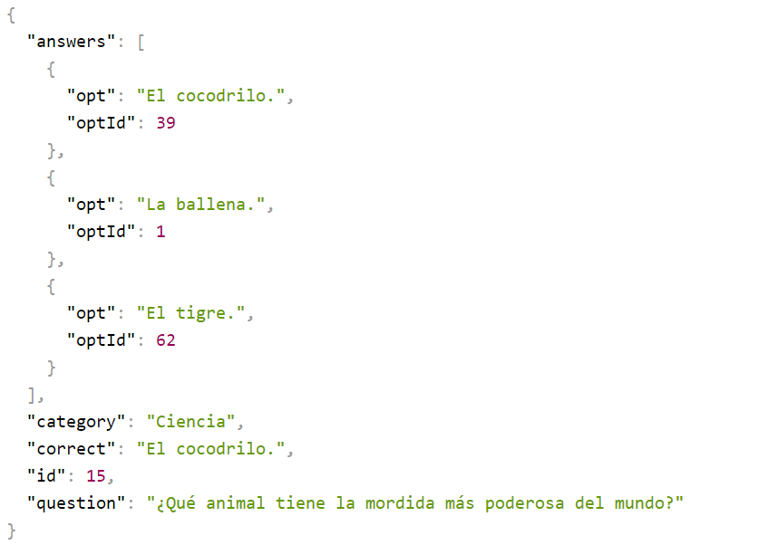
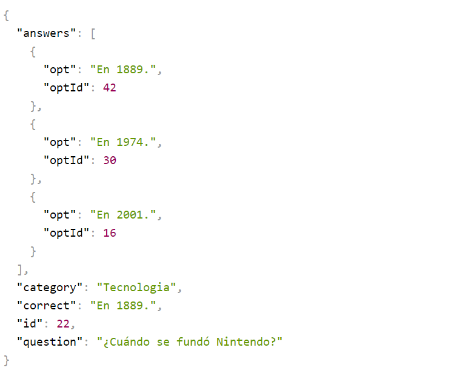

# API QUIZ

*This API has two routes*

The first route is /quiz and return random question of any category, example: 

The Last route is /quiz/Category and return random question by category, example: 

### Categories:

- Ciencia
- Tecnologia